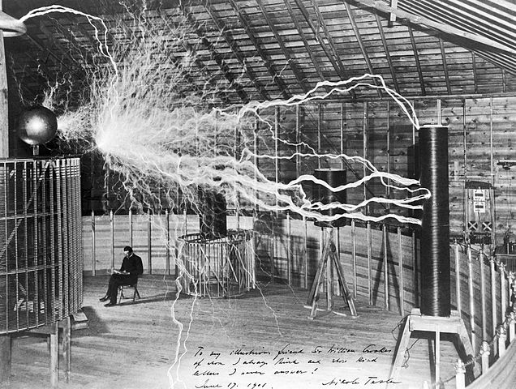
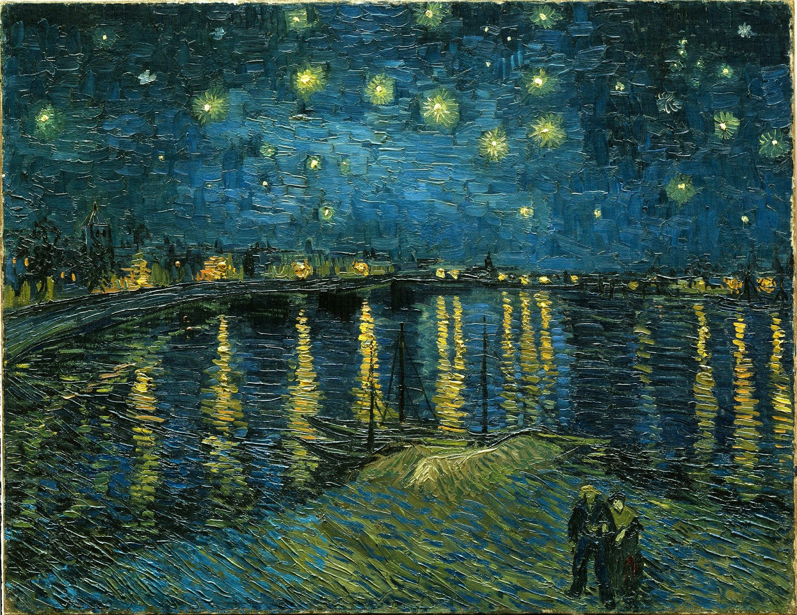

## Bio
I am in my third year of study at Brock University, majoring in Interactive Arts and Sciences and Studio Art. I am concentrating on instructional design, with a specific focus on user interface design. My co-major with studio art helps me develop my visual communication skills, so I can develop interfaces that are less wordy and more intuitive. The struggle between intuition and the regional and educational biases that support it, would be an area of interest for me in a post-graduate program. My presentation on Wireless Electricity demonstrates the possibility of a new form of interaction with technology. Developing new usage patterns and making charging more intuitive, by not having to think about the need to charge electronics. I will further develop this research into intuitive user interface design, while focusing on consumer products and the arts. This would involve developing new methods of interacting with visual arts in the exhibition space, and theatrical space. The consumer product focus would be heavily based on background tasks that automate physical processes, for example the light turning on automatically in a refrigerator, or having a phone screen turn on when it is removed from your pocket. 

## Featured Project: Wireless Electricity

-- 250 word intro --

-- 250 word how it evolved, and link to commits where you changed your observation --

View [Wireless Electricity](https://harvinds.github.io/reveal/index.html)

## Collaborative Project
-- 100 word project description --
-- 250 word collab statement, aproached work like this which reflected in this work (link to example), also approach and reflected in this (link to work) also contributed these assets below --

[Commit](link goes here)

## Research Presentation

[Wireless Electricity](https://harvinds.github.io/reveal/index.html)

## Academic Blog

[Response to Stephen Ramsey](blog)

